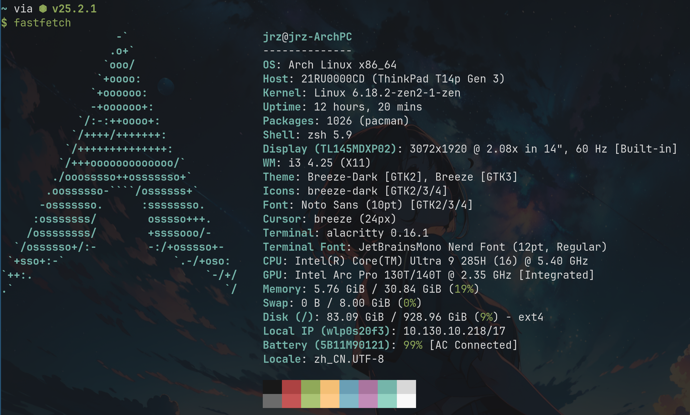
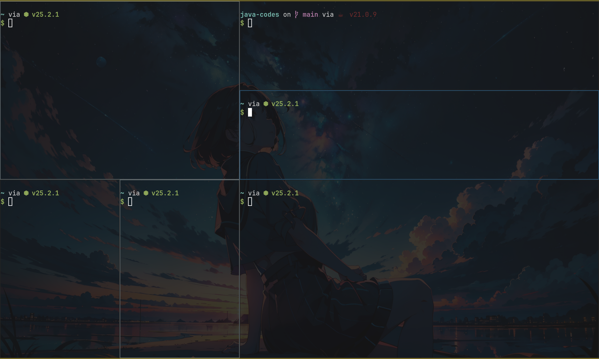

# arch-linux

本人折腾Arch Linux的相关配置，以及Linux的相关工具和shell编程知识学习

## 系统安装

Reference:

- <https://lingxi9374.github.io/posts/%E6%95%99%E7%A8%8B/archinst/>

- <https://lingxi9374.github.io/posts/%E6%95%99%E7%A8%8B/archconfiguration/>

- 中文输入法以及KDE桌面配置：<https://www.bilibili.com/video/BV1jys6eaEtM/?spm_id_from=333.1391.0.0&vd_source=10f210b489ff64067fea44f3a90f4b37>

- `zsh`: <https://www.cnblogs.com/Likfees/p/14646078.html>

- `flatpak`: <https://www.cnblogs.com/lwlnice/p/18263967> 里面的其中一步可能会报错路径不存在，直接使用Vim在`/etc/environment`中添加以下内容:

```bash
sudo vim /etc/environment
# 添加以下内容:
XDG_DATA_DIRS=/home/jrz/.local/share/flatpak/exports/share:/var/lib/flatpak/exports/share:/usr/local/share:/usr/share
```

- `wallpaper`:

<https://haowallpaper.com/homeViewLook/16715497910422912>

<https://github.com/JaKooLit/Wallpaper-Bank.git>

## 系统概览

### fastfetch展示



### UI展示


### shell展示



## 具体配置

### 外观渲染

- 桌面壁纸：`feh`渲染
- 状态栏：`polybar`开源项目
- WM Compositor：`picom`
- terminal：`alacrity starship`

### 开发环境

- 多窗口合作: i3 and tmux
- 文本代码编辑: Neovim and Vim
- 终端文档管理器: yazi
- 进程监控管理: htop
- Linux命令查看: tldr and man
- 文件搜索: fzf fd grep ripgrep
- Markdown终端文件查看: glow
- Api检测工具: Postman
- git: Lazygit (**无敌好用**)
- 应用程序管理器: rofi and dmenu
- 远程连接ssh: vscode and terminal
- 终端: zsh
- Python包管理: uv

### 配置存放文件

配置文件统一存放在`config`目录下

- `.vimrc`: Vim配置文件, 对应的存放地址为`~/.vimrc`

- `fish_prompt.fish`: fish终端渲染配置

- `hosts`: 主机配置，对应的是`/etc/hosts`

- `starship.toml`: starship相关配置，对应的存放地址为`~/.config/starship.toml`

- `config`: i3的相关配置，对应的存放地址为`~/.config/i3/config`。里面有一些配置启动、i3快捷键修改等内容

- `touchpad.sh`: 笔记本触控板设置脚本，使其支持触控板轻点，以及反向滚动下拉

```bash
# 首先查看设备，找到Touchpad对应的id
$ xinput list

# 然后查看Touchpad对于的具体功能设置
$ xinput list-props [id]

# 寻找以下两行内容, 分别对应的是触控板轻点触发和滚轮反向滚动
libinput Tapping Enabled (347): 1
libinput Natural Scrolling Enabled (320): 1

# 上面两行后面的如果设置不为1代表没有开启，此时需要手动开启
# 10对应的是Touchpad的ID, 347和320分别代表上面的功能ID，1代表要设置的功能值(开启 or 关闭)
~/.config/i3
$ cat touchpad.sh
#!/bin/bash

xinput set-prop 10 347 1
xinput set-prop 10 320 1

```

- `zshrc`: zsh配置文件, 对应的存放地址为`~/.zshrc`

- `.tmux.conf`: `tmux`的相关配置, 存放在`~/.tmux.conf`

- `nvim/`: 存放nvim的相关配置文件，基本是采用的`LazyVim`的配置，LSP等直接通过`Mason`安装

## 问题解决及工具使用学习

问题解决及工具使用统一放入`tools`目录下
