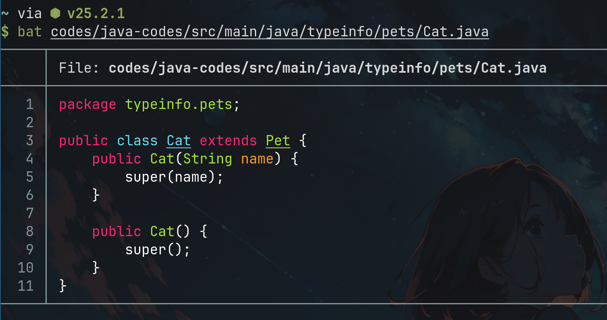
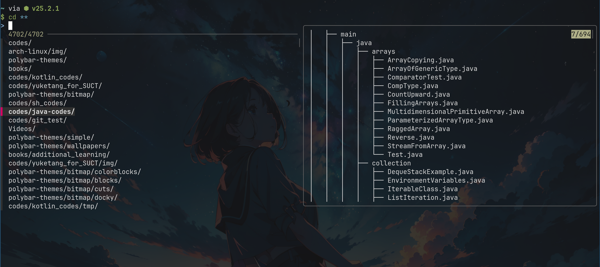

# fzf

`fzf`是一款文件快速查找工具，可以进行模糊搜索等操作

## 目录快速跳转

`fzf`可以结合`fd`等工具实现终端中的目录快速跳转，实现方式就是在`.zshrc`中添加相关写好的`fzf`脚本配置或者是利用终端命令

```bash
cd $(fd --type d | fzf)
```

```bash
# 加载 fzf 默认的 zsh keybindings（含 fzf-cd-widget）
source /usr/share/fzf/key-bindings.zsh
source /usr/share/fzf/completion.zsh

# fd + fzf 的 Alt-C（改写 fzf-cd-widget），兼容取消时重绘 prompt
fzf-cd-widget() {
  local dir ret

  # 调用 fd -> fzf
  dir=$(fd . --type d --hidden --follow --exclude .git 2>/dev/null \
        | fzf --height 40% --layout=reverse +m)
  ret=$?   # 保存 fzf 的退出状态

  # 如果用户没有选择（按 Esc/Ctrl-C）或 fzf 出错，重绘后返回
  if [[ $ret -ne 0 || -z $dir ]]; then
    zle reset-prompt 2>/dev/null || true
    zle -R 2>/dev/null || true
    return
  fi

  # 如果选择了目录，使用 builtin cd 切换；失败也重绘后返回
  if ! builtin cd -- "$dir"; then
    zle reset-prompt 2>/dev/null || true
    zle -R 2>/dev/null || true
    return
  fi

  # 切换成功后，确保 prompt/命令行立即更新
  zle reset-prompt 2>/dev/null || true
  zle -R 2>/dev/null || true
}

zle -N fzf-cd-widget
bindkey '\ec' fzf-cd-widget
```

最后的快捷键为:

```text
Ctrl+T 用 fzf 选择文件/目录插入命令行
Alt+C 用 fzf 选择目录并 cd到那个目录下
Ctrl+R 模糊搜索命令历史
```

## fzf组合命令

显示的列表中，`Ctrl+k`为向上选择条目，`Ctrl+j`为向下选择条目

```bash
# 1. 与vim组合，fzf中选择文件之后vim直接编辑
vim $(fzf)

# 2. 与bat组合 在终端高亮显示文本
fzf | xargs bat

# 3. 文件预览，可以取一个别名fzfp进行简化
fzf --preview "bat --color always {}"

# 4. fzf选择文件等将文本插入命令行
# 1) Ctrl+T 实现
# 2) ** + Tab，以下是一个例子
bat ** + Tab 

# 5. ** + Tab 功能
# bat使用, 相当于Ctrl+T
bat ** + Tab 
# ssh使用，列出所有登录过的主机名
ssh ** + Tab
# kill使用，列出当期所有运行进程
kill ** + Tab
# unset命令，列出当前shell中的所有变量
unset ** + Tab
# unalias命令，列出所有的别名
unalias ** + Tab
# cd命令，可以利用tree来预览目录信息
cd ** + Tab
```

### 补充说明

1. 上述`cd ** + Tab`的实现需要在`.zshrc`中进行配置，添加：

```text
# fzf cd目录预览
_fzf_comprun() {
    local command=$1
    shift

    case "$command" in
    cd) fzf --preview 'tree {}' "$@" ;;
    *) fzf "$@" ;;
    esac
}
```

## 效果展示

### 目录快速跳转


### 终端高亮显示文本



### cd目录预览功能


